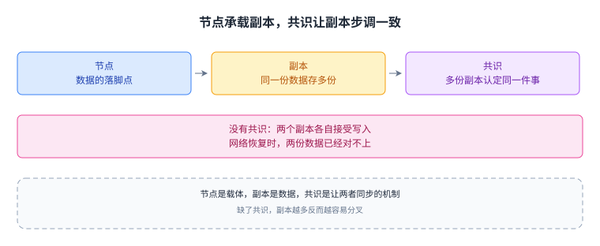
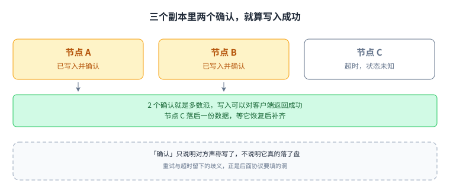

+++
title = "什么是分布式系统"
lecture = 1
slug = "what-is-a-distributed-system"
status = "draft"
source_kind = "notes"
source_url = "https://example.org/courselingo-demo/lecture-01"
source_title = "CourseLingo Demo — What is a Distributed System"
output_mode = "explanation"
+++

> **这是一份演示稿件，不是任何真实课程的翻译。**
> 本篇由 CourseLingo 原创撰写，用于验证流水线（校验 + 构建 + 部署）是否跑通。
> 它演示了术语标记、代码块、表格与配图的写法，可以整篇替换掉。

## 先建立一个直觉

一台机器扛不住的时候，最自然的想法是多找几台一起干。这一讲要解决的就是这件事：几台机器凑成一个系统之后，写代码的难度为什么会换一个量级。

原本是「一个进程读自己的内存」，现在变成「一堆进程通过网络互相发消息」。[[term:distributed-system]] 描述的就是后者。同一段逻辑，把函数调用换成网络消息之后，可靠性、顺序、成败判定三样东西同时失去保证。下图把这两种世界并排放一次。


`send` 返回成功只说明本机把消息交给了网络，不说明对方收到了。后面每一讲都在处理这三件事中的一件。

## 三个绕不开的概念

### 节点

[[term:node]] 是集群里的一台机器或一个独立进程。节点之间只能靠收发消息通信，谁也不知道对方的真实状态，所以「探测对方还活着吗」本身就是难题。

### 副本

[[term:replication]] 是把同一份数据放在多个节点上。好处很直接：一个节点挂掉，数据还在别处。代价同样直接：写一份要写多处，它们之间可能暂时不一致。

### 共识

[[term:consensus]] 是让多个节点对同一件事达成一致的过程，它是 [[term:replication]] 能正确工作的前提：如果节点们对「谁是主」意见不一，副本就无从谈起。达成共识的常见做法是选出唯一的协调者，即 [[term:leader-election]]。

下面这张图把三者的分工画在一起：节点是载体，副本是数据，共识让这些拷贝步调一致。



图里下半部分那个分叉状态并不是罕见故障：网络一分区就会出现。

## 一个最小例子

设想把一条数据写进三个节点。最朴素的写法是逐个发送，再等多数派确认：

```python
def replicate(key, value, replicas):
    """把一条键值对写进所有副本，返回是否得到多数派确认。"""
    acks = 0
    for node in replicas:
        # 这里的 send 可能失败，也可能永远不返回
        if send(node, ("put", key, value)):
            acks += 1
    return acks > len(replicas) // 2
```

这段代码故意留了两个洞：

- `send` 失败怎么办？重试多少次算够？
- 如果 `send` 成功了，但对方其实没写进去，多数派确认还有意义吗？

确认到底证明了什么？多数派只保证「多数节点说写了」，不保证真的落了盘。



三个 [[term:node]] 里挂掉一个，剩下两个仍是多数派，写入依然成功。代价是节点 C 落后一份数据，需要有人补齐。

## 误解与边界

网络断了不是「某台机器坏了」那么简单。链路一断，两台机器都活着、都能服务，但谁也证明不了对方还活着。


这种状态叫网络分区，它解释了几条常见误解：

| 误解 | 实际情况 |
| --- | --- |
| 加机器就能提升性能 | 协调开销可能让整体更慢 |
| 网络是可靠的 | 丢包、延迟、分区都是常态 |
| 存在全局时钟 | 只有各机器自己的时钟，而且会漂移 |
| 副本越多越安全 | 副本越多，保持一致的成本越高 |

[[term:fault-tolerance]] 也不是「不出故障」，而是出了故障还能继续正确工作。这些机制在真实系统里都有名字：GFS 与 HDFS 把数据放三个副本，Raft 与 Paxos 用多数派选主，ZooKeeper 与 etcd 把共识做成可以直接调用的库。

## 脉络回顾

这一讲没有给算法，只给了三条前提。回头看整条脉络：

1. 现状与痛点：单机的三样保证在网络上一条都不成立。
2. 核心思路：没有全局真相，就退到「多数派」这种局部可验证的保证。
3. 机制：多数派写入是第一个最小例子，它留的两个洞要靠协议填。
4. 代价与边界：不一致的窗口、协调开销、分区分叉，都是这套做法的账单。

下一讲从 [[term:consensus]] 开始讲真正的协议。判断自己有没有读懂，可以看能不能说清：为什么「多数派确认」比「每个节点都确认」更值得追求。
