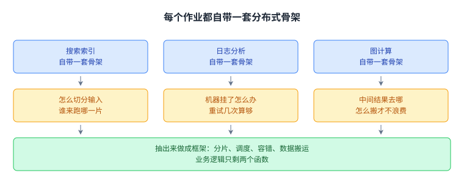
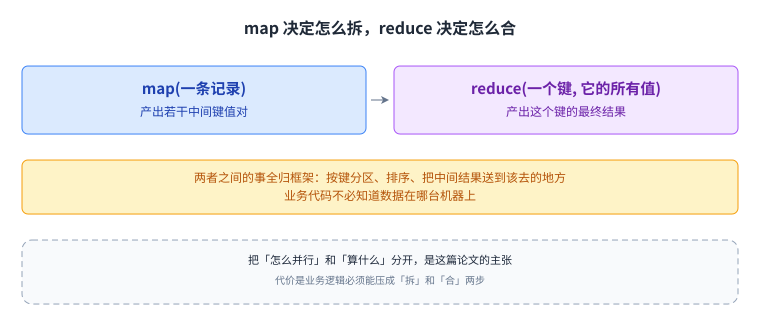
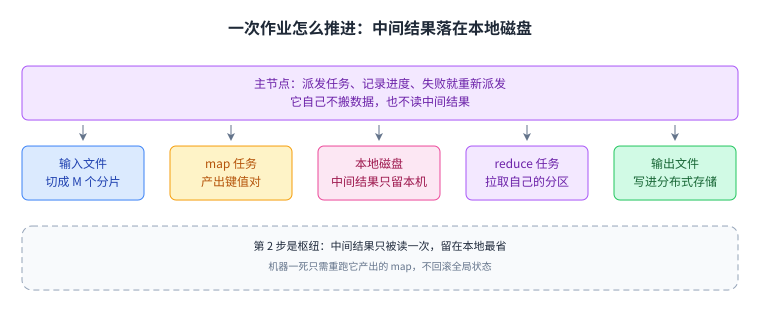
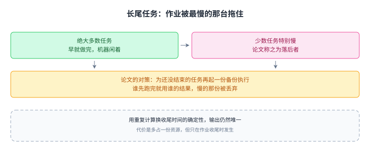

+++
kind = "paper"
paper = "mapreduce"
title = "MapReduce 导读"
status = "draft"
output_mode = "guide"
+++

> **这是「导读」，不是翻译。**
> 本篇用我们自己的话讲清楚 MapReduce 这篇论文要解决什么问题、怎么解的、代价是什么。
> 不是原文的逐句对照，也不包含原文段落。
>
> 原始论文见本仓库 `papers.toml` 中的 `mapreduce` 条目。这里不写成相对链接：
> `papers.toml` 不在站点里，相对链接会让 MkDocs 的链接检查失败，`--strict` 下直接中断构建。

## 这篇论文要解决什么问题

2004 年，Google 面对一个很具体的麻烦：搜索索引、日志分析、图计算，这些任务的数据量大到一台机器放不下、也跑不完。

麻烦不在「算不动」，而在于每一类任务都要重写一遍分布式代码：怎么切分输入、机器挂了怎么重试、中间结果送到哪台机器。同一套骨架复制很多遍，每一份都可能写错。

论文的主张是：把「怎么并行」抽出来做成一个库，业务逻辑只写两个函数。下图是抽之前与抽之后。

骨架只写一遍之后，[[term:distributed-system]] 就不再是每个业务方都要重新解决的问题。

## 核心抽象：两个函数

整个模型只有两个函数：

| 函数 | 输入 | 输出 | 读者的职责 |
| --- | --- | --- | --- |
| `map` | 一条输入记录 | 若干中间键值对 | 决定「怎么拆」 |
| `reduce` | 一个键 + 它的所有值 | 若干结果 | 决定「怎么合」 |

两个函数之间还有一大堆事：按键分区、排序、[[term:fault-tolerance]]、把中间结果送到该去的地方，全部由框架负责，业务代码不必知道数据在哪台 [[term:node]] 上。

它把「分布式」从一个每次都要重新解决的问题，变成了不用再想的前提。代价是业务逻辑必须能压成「拆」和「合」两步。

## 执行流程

一次作业的推进大致是：

1. 输入被切成若干分片，每个分片交给一个 `map` 任务。
2. `map` 产出中间键值对，按键分区后写到本地磁盘，不写全局存储：中间结果只被消费一次，走网络存储纯属浪费。
3. `reduce` 任务从各个 `map` 任务的输出位置拉取自己负责的分区，按键聚合。
4. 一个主节点（master）负责派发任务、记录进度、处理失败。

第 2 步是枢纽：把中间结果留在本地，失败恢复的成本就被限制在重跑一个 `map` 任务，某个 [[term:node]] 挂掉时也不必回滚全局状态。

## 边界与代价

论文没有回避边界情况，这是它最经得起读的部分：

- 落后者（stragglers）：绝大多数任务早就完成，少数机器特别慢，整个作业被拖住。论文的对策是备份执行：同一个任务在另一台机器上再跑一遍，谁先完成用谁。
- 分区函数选得不好：大量数据被塞进同一个 reducer，其他 reducer 只能干等。
- 代价要还：迭代式算法每轮都要落一次盘，后来把中间结果留在内存的系统（如 Spark）针对的正是这一点。

备份执行的代价是多占一份资源，换来的是收尾时间不再由单台慢机器决定。论文在这里还做了一个取舍：输入输出落在支持 [[term:replication]] 的存储上（GFS、HDFS 都是），中间结果不复制，坏了就让 `map` 重算。master 结构上仍是单点，论文给它做检查点，但没有用 [[term:leader-election]] 或 [[term:consensus]] 做主备切换。

## 读完应该能回答

- 为什么中间结果要写本地磁盘，而不像输入输出那样走分布式存储？
- 备份执行多占一份资源，这份代价换来了什么？
- `map` 与 `reduce` 的数量分别由什么决定，哪一个更容易变成瓶颈？

## 脉络回顾

这篇论文的主张可以压成一句：把「怎么并行」和「算什么」分开。

- 现状与痛点：每类大数据任务都在重复实现同一套分布式骨架，重复且容易错。
- 核心思路：把骨架做成库，业务只交两个函数。
- 机制：中间结果落本地磁盘，失败只重跑一个任务，收尾靠备份执行抢时间。
- 代价与边界：迭代式算法被落盘拖住，master 是单点，倾斜的分区会放大长尾。

[[term:node]] 之间的分工与失败处理，是后面 [[term:consensus]] 讨论的前置直觉。MapReduce 选择「重跑」而不是让节点先达成一致，这个取舍值得和 Raft、Paxos 对照着看。
